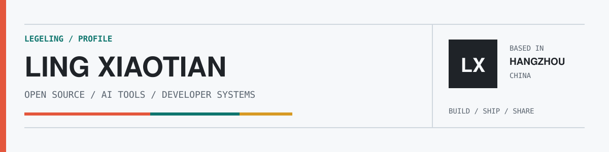

<picture>
  <source media="(max-width: 600px) and (prefers-color-scheme: dark)" srcset="./assets/profile-header-mobile-dark.svg">
  <source media="(max-width: 600px)" srcset="./assets/profile-header-mobile-light.svg">
  <source media="(prefers-color-scheme: dark)" srcset="./assets/profile-header-dark.svg">
  <source media="(prefers-color-scheme: light)" srcset="./assets/profile-header-light.svg">
  
</picture>

## Hello, I'm 凌小添 / Ling Xiaotian

我在杭州做开源产品和开发者工具，关注 AI 工具链、自动化与那些本来应该更可靠的软件。

I build practical AI products and developer infrastructure, then keep polishing the details that usually get left behind.

<p>
  <a href="https://prompthub.click"></a>
  <a href="https://codexpet.top"></a>
  <a href="https://x.com/legeling567"></a>
  <a href="mailto:legeling567@gmail.com"></a>
</p>

### Selected work

| Project | What it does |
| :--- | :--- |
| **[PromptHub](https://github.com/legeling/PromptHub)** <br> [](https://github.com/legeling/PromptHub/stargazers) | An all-in-one workspace for prompts, skills, and agents, with cloud sync, backup, versioning, and one-click distribution. |
| **[awesome-codex-pet](https://github.com/legeling/awesome-codex-pet)** <br> [](https://github.com/legeling/awesome-codex-pet/stargazers) | A curated gallery of animated Codex pets with previews and one-command installation. |
| **[ClawGuard](https://github.com/legeling/ClawGuard)** | A CLI-first security audit, hardening, and signed-release verification tool for OpenClaw. |
| **[AltForge](https://github.com/legeling/AltForge)** | A maintained AltStore derivative focused on reliability, compatibility, and better sideloading. |

### Current focus

```text
01  AI asset management       prompts / skills / agents
02  Developer experience      automation / distribution / desktop tools
03  Software reliability      security / compatibility / long-lived fixes
```

### Toolkit


---

<sub>Open source from Hangzhou. Chinese / English.</sub>
